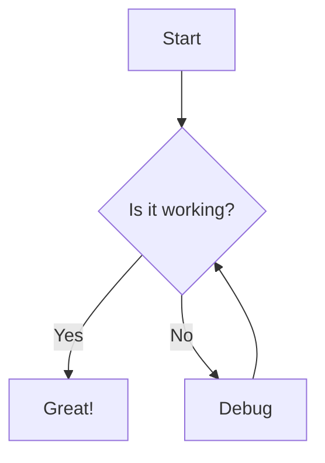
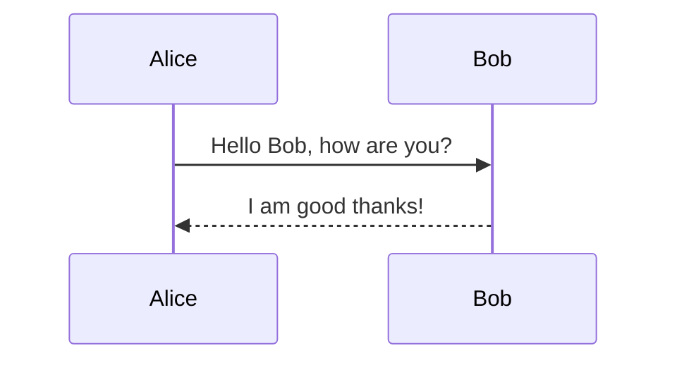

# Markdown Comprehensive Test Suite

## 1. Headings (标题)

# H1 Heading
## H2 Heading
### H3 Heading
#### H4 Heading
##### H5 Heading
###### H6 Heading

## 2. Text Formatting (文本格式)

**Bold Text (粗体)**
*Italic Text (斜体)*
***Bold and Italic (粗斜体)***
~~Strikethrough (删除线)~~
`Inline Code (行内代码)`
<u>Underline (下划线 - HTML)</u>
==Highlight (高亮 - Extended)==
Subscript: H~2~O (下标)
Superscript: X^2^ (上标)
Keyboard keys: <kbd>Ctrl</kbd> + <kbd>C</kbd>

## 3. Lists (列表)

### Unordered List
- Item 1
- Item 2
  - Sub-item 2.1
  - Sub-item 2.2
    - Sub-sub-item 2.2.1
- Item 3

### Ordered List
1. First item
2. Second item
   1. Sub-item 2.1
   2. Sub-item 2.2
3. Third item

### Task List (GFM)
- [ ] Incomplete task
- [x] Completed task
- [ ] Another incomplete task

### Definition List (Extended)
Term 1
: Definition 1

Term 2
: Definition 2
: Definition 2 (alternate)

## 4. Links and Images (链接与图片)

[OpenAI Website](https://www.openai.com "Optional Title")
[Relative Link](./other-file.md)
Autolink: https://www.google.com


## 5. Blockquotes (引用)

> This is a blockquote.
> It can span multiple lines.
> 
> > Nested blockquote level 2.
> > > Nested blockquote level 3.

## 6. Code Blocks (代码块)

### JavaScript
```javascript
function greet(name) {
  console.log(`Hello, ${name}!`);
  return true;
}
greet('World');
```

### Python
```python
def fibonacci(n):
    if n <= 1:
        return n
    else:
        return fibonacci(n-1) + fibonacci(n-2)
```

### Rust
```rust
fn main() {
    println!("Hello, world!");
}
```

### Diff (Syntax Highlighting)
```diff
- const oldVal = 1;
+ const newVal = 2;
```

## 7. Tables (表格)

| Left Aligned | Center Aligned | Right Aligned |
| :--- | :---: | ---: |
| Cell 1 | Cell 2 | Cell 3 |
| Content | More Content | $100 |

## 8. Math / LaTeX (数学公式)

Inline Math: $E = mc^2$

Block Math:
$$
\sum_{n=1}^{\infty} \frac{1}{n^2} = \frac{\pi^2}{6}
$$

Matrix:
$$
\begin{pmatrix}
a & b \\
c & d
\end{pmatrix}
$$

## 9. Diagrams (Mermaid)

### Flowchart


### Sequence Diagram


## 10. Extended Syntax / Notion-like Features

### Footnotes
Here is a simple footnote[^1].
A footnote can also have multiple lines[^2].

[^1]: This is the first footnote.
[^2]: This is the second footnote.
    It has multiple lines.

### Admonitions / Callouts (Common Extension)

> [!NOTE]
> This is a note callout.

> [!TIP]
> Pro tip: Use callouts to highlight information.

> [!WARNING]
> Warning: Proceed with caution.

> [!DANGER]
> Danger: Do not touch!

### Details / Summary (Collapsible)
<details>
<summary>Click to expand</summary>

Here is the hidden content inside the details tag.
It supports **markdown** inside.
</details>

## 11. Horizontal Rules (分割线)

---

***

___

## 12. Miscellaneous

### Escaping Characters
*Literal Asterisks*
# Literal Hashtag

### HTML Tags (If supported)
<div style="background-color: #f0f0f0; padding: 10px; border-radius: 5px;">
  This is a raw HTML div with inline styles.
</div>