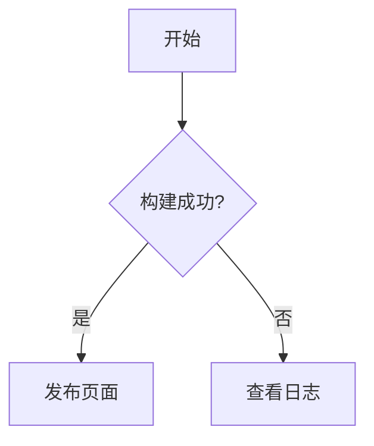

# Markdown 语法展示

这是一篇用于 Docship 预览的综合 Markdown 文档。它同时覆盖 CommonMark、GitHub Flavored Markdown（GFM）以及常见文档站扩展，方便在 showcase 中比较不同框架的渲染结果。

## 目录

- [标题与段落](#标题与段落)
- [文字格式](#文字格式)
- [列表](#列表)
- [链接与图片](#链接与图片)
- [引用](#引用)
- [代码](#代码)
- [表格](#表格)
- [扩展语法](#扩展语法)
- [原始 HTML](#原始-html)

## 标题与段落

上面是一级标题。下面演示 Setext 风格标题。

Setext 二级标题
--------------

Setext 一级标题
==============

这是一个普通段落。Markdown 中连续的文本会合并为同一段，空一行即可开始新段落。
行末两个空格会产生换行。<br>
这行会出现在上一行的下面。

## 文字格式

- *斜体*、_斜体_
- **粗体**、__粗体__
- ***粗斜体***、___粗斜体___
- ~~删除线~~（GFM）
- `行内代码` 和 ``包含 ` 反引号的代码``
- 普通链接中的 [链接文字](https://example.com "链接标题")
- 转义符号：\*星号\*、\#井号、\[方括号\]
- 特殊字符：&lt;、&gt;、&amp; 会被正确显示

## 列表

### 无序列表

- 第一项
- 第二项
  - 嵌套项 2.1
  - 嵌套项 2.2
    - 第三级项目
- 第三项

### 有序列表

1. 第一步
2. 第二步
   1. 第二步的子项
   2. 另一个子项
3. 第三步

### 任务列表

- [x] 已完成任务
- [ ] 待完成任务
- [ ] 另一个待办事项

### 定义列表

Markdown
: 一种轻量级标记语言

GFM
: GitHub Flavored Markdown

## 链接与图片

### 链接

[行内链接](https://github.com/NekoTick/docship)

[带标题的链接](https://github.com/NekoTick/docship "Docship 源码")

<https://github.com/NekoTick/docship>

<hello@example.com>

也可以使用引用式链接：[项目主页][docship-home]。

[docship-home]: https://github.com/NekoTick/docship "Docship"

### 图片


图片也可以作为链接：

[](https://github.com/NekoTick/docship)

## 引用

> 这是一个引用段落。
>
> 引用可以包含 **粗体**、`代码` 以及链接。
>
> > 这是嵌套引用。
> >
> > 嵌套引用可以继续包含列表：
> >
> > - 项目 A
> > - 项目 B

## 代码

### 行内代码

使用 `npm run build` 构建项目。

### 围栏代码块

```javascript
function greet(name) {
  return `Hello, ${name}!`;
}

console.log(greet('Markdown'));
```

```python
def fibonacci(n):
    if n < 2:
        return n
    return fibonacci(n - 1) + fibonacci(n - 2)
```

```json
{
  "name": "docship",
  "markdown": true
}
```

```diff
- const theme = 'light';
+ const theme = 'dark';
```

### 缩进代码块

    // 四个空格也可以创建代码块
    const answer = 42;

## 表格

### 对齐与格式

| 左对齐 | 居中对齐 | 右对齐 | 包含 Markdown |
| :--- | :---: | ---: | :--- |
| 文本 | 文本 | 100 | **粗体** |
| `代码` | [链接](https://example.com) | 99.5 | ~~删除线~~ |
| 长内容可以正常换行 | 第二列 | 0 | `a\|b` 中的竖线已转义 |

### 项目比较表

| 特性 | CommonMark | GFM | Docship 预览 |
| :--- | :---: | :---: | :---: |
| 标题、段落 | 支持 | 支持 | 支持 |
| 任务列表 | - | 支持 | 支持 |
| 表格 | - | 支持 | 支持 |
| 脚注 | 扩展 | 支持 | 按框架能力渲染 |
| 数学公式 | 扩展 | 扩展 | 见下方示例 |

### HTML 表格

<table>
  <thead>
    <tr><th>状态</th><th>含义</th></tr>
  </thead>
  <tbody>
    <tr><td>通过</td><td>语法已渲染</td></tr>
    <tr><td>扩展</td><td>由框架插件提供</td></tr>
  </tbody>
</table>

## 扩展语法

### 分隔线

三种写法都表示水平分隔线：

---

***

___

### 脚注

这里有一个脚注[^first]，还有一个多行脚注[^second]。

[^first]: 脚注可以放在文档末尾。
[^second]: 脚注内容可以分成多行。
    缩进的行仍属于同一个脚注。

### 数学公式（LaTeX）

行内公式通常写作 $E = mc^2$。

部分框架需要 KaTeX 或 MathJax 插件才能显示块级公式：

```math
\sum_{n=1}^{\infty} \frac{1}{n^2} = \frac{\pi^2}{6}
```

### Mermaid 图表

部分框架支持直接渲染 Mermaid：



### 可折叠内容

<details>
<summary>点击展开更多内容</summary>

这里是默认折叠的内容，里面仍然可以使用 **Markdown**。

- 隐藏项目一
- 隐藏项目二

</details>

### 提示块（部分框架支持）

> [!NOTE]
> 这是一个提示块。

> [!TIP]
> 这是一个技巧提示。

> [!WARNING]
> 这是一个警告提示。

> [!IMPORTANT]
> 这是一个重要提示。

> [!CAUTION]
> 这是一个注意事项。

### YAML Front Matter

Front Matter 通常位于文件开头。这里用代码块展示，避免影响当前页面配置：

```yaml
---
title: Markdown 示例
description: 展示常用 Markdown 语法
---
```

## 原始 HTML

Markdown 允许在需要时混入安全的 HTML 标签：

<kbd>Ctrl</kbd> + <kbd>C</kbd> 复制

H<sub>2</sub>O 和 x<sup>2</sup>

<mark>高亮文本</mark>

<!-- 这是不会显示的 HTML 注释 -->

<div>
  <strong>HTML 容器</strong> 里的内容也可以和 Markdown 共存。
</div>

## 兼容性说明

Docship 会把根目录的 Markdown 文件交给各个框架工作流构建。当前页面就是仓库首页，因此会自动出现在 showcase 的每个框架卡片中；不同框架对数学、Mermaid、提示块和 HTML 扩展的支持可能略有差异。

---

*文档由 Docship Markdown showcase 提供。*
