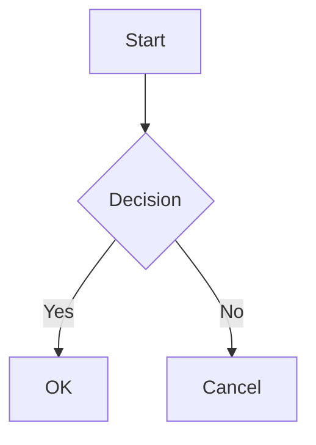

> ⚠️ **This is a test file for DocShip development. The content below is sample documentation.**

# Test File with Broken Content

This file contains intentionally broken markdown to test error handling.

## Normal Content

This is normal text that should render correctly.

- Item 1
- Item 2
- Item 3

## Broken Image Links

These should be automatically cleaned:


## Invalid HTML Tags

```html
<invalid-tag>This is not a valid HTML tag</invalid-tag>
```

```html
<script>alert('This should be escaped or ignored')</script>
```

```html
<style>body { background: red; }</style>
```

```html
<div onclick="alert('xss')">Click me</div>
```

## Unclosed Tags

```html
<div>This div is never closed

<span>Neither is this span
```

## Raw HTML Mixed with Markdown

<table>
<tr><td>

**Bold in table**

- List in table
- Another item

</td></tr>
</table>

## Broken Links

[Link to nowhere](./this-file-does-not-exist.md)

[Another broken link](/path/to/nowhere)

[External broken](https://this-domain-does-not-exist-12345.com/page)

## Malformed Markdown

###No space after hash

**unclosed bold

*unclosed italic

`unclosed code

~~unclosed strikethrough

## Weird Whitespace

Line with trailing spaces   
Line with tabs		between
Line with multiple


blank lines above

## Escape Characters

\*not bold\*

\`not code\`

\[not a link\](url)

\\backslash

## Code Blocks

```javascript
// This should work fine
const x = 1;
console.log(x);
```

```
No language specified
```

```invalidlanguage
Unknown language
```

## Deeply Nested Lists

- Level 1
  - Level 2
    - Level 3
      - Level 4
        - Level 5
          - Level 6
            - Level 7

## Very Long Line

ThisIsAVeryLongLineWithNoSpacesThatMightCauseLayoutIssuesInSomeFrameworksBecauseItCannotBeWrappedProperlyAndMightOverflowTheContainerOrCauseHorizontalScrollingWhichIsNotIdeal

## Tables

| Column 1 | Column 2 | Column 3 |
|----------|----------|----------|
| A | B | C |
| D | E | F |

### Malformed Table

| Missing | Separator
| A | B |
| C |

## Special Characters

- Ampersand: &
- Less than: <
- Greater than: >
- Quote: "
- Apostrophe: '
- Pipe in text: |
- Backslash: \

## Unicode

- Chinese: 你好世界
- Japanese: こんにちは
- Korean: 안녕하세요
- Emoji: 🚀 📦 ✨ 🎉
- RTL Arabic: مرحبا
- RTL Hebrew: שלום

## Math (if supported)

Inline: $E = mc^2$

Block:

$$
\sum_{i=1}^{n} i = \frac{n(n+1)}{2}
$$

Broken math: $unclosed

$$
also unclosed

## Mermaid (if supported)



## Front Matter in Wrong Place

Not at the top, should be treated as text:

---
title: This is not front matter
---

## HTML Entities

&nbsp; &amp; &lt; &gt; &quot; &apos;

&#60; &#62; &#38;

&invalid; &also-invalid;

## Zero Width Characters

Here​is​zero​width​space

Here‌is‌zero‌width‌non‌joiner

## End

If you can see this, the file rendered successfully despite the broken content above.
