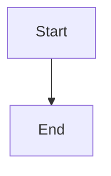

> ⚠️ **This is a test file for DocShip development. The content below is sample documentation.**

# Code Block Edge Cases

## Unknown Languages

These code blocks use languages that may not be recognized:

```invalidlanguage
This language doesn't exist
```

```nonexistent
Some code here
```

```fake-lang-123
More fake code
```

## Diagram Languages

These are common diagram languages that may not be supported:



```plantuml
Alice -> Bob: Hello
```

## Empty Code Blocks

```
```

```text
```

## Inline Code

Normal inline code: `const x = 1`

Double backticks: ``code with `backtick` inside``

## Very Long Line

```text
aaaaaaaaaaaaaaaaaaaaaaaaaaaaaaaaaaaaaaaaaaaaaaaaaaaaaaaaaaaaaaaaaaaaaaaaaaaaaaaaaaaaaaaaaaaaaaaaaaaa
```

## Normal Code

```javascript
// This should work fine
const greeting = "Hello, World!";
console.log(greeting);
```

```python
# Python code
def hello():
    print("Hello")
```

## Normal Content

This should render fine.
